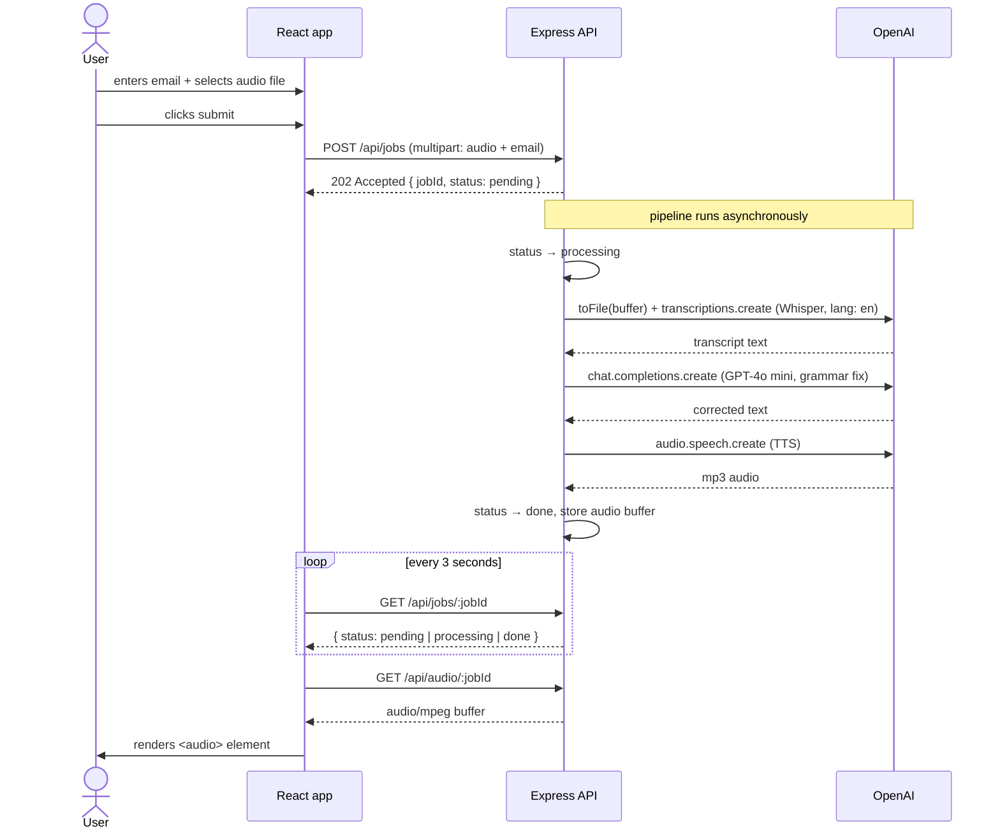

# MVP
A single-page application that allows users to upload spoken audio and submit
it together with their email address to a REST API backend. The backend
immediately returns a job ID and processes the audio asynchronously —
transcribing it via Whisper, correcting grammar via GPT-4o mini, and
regenerating it as speech via TTS. The frontend polls for job status every
3 seconds and renders the corrected audio when complete.

## Limitations
Everything is stored in memory for now. The pipeline language is
hardcoded to English. A file upload is used instead of in-browser recording.
I focused mainly on the Backend code and the pipeline.

## Flow

# Target state

## Improvements
A couple of improvements below:

### Authentication
- Currently anyone who knows a jobID can access the audio
- Users need to type their email. Ideally user logs in and we have their email, so there's no need to extra proivide that.

### Async processing
Currently - promise based. Ideally we introduce a queue and worker for better scaling and durability.

### Notifications
Frontend currently polls GET job every 3 seconds generating unnecessary requests. 
Two ideas:
- SSE - server pushes a done event to the browser the moment the worker finishes to avoid polling
- Email - send an email when job completes

### Persistent storage
Currently everything is handled in memory (jobs, audio). Ideally we store the job in the database and both audios (original one and corrected) in an object storage like S3.

### OpenAI misuse 
Without rate limiting, a single user could submit hundreds of jobs and exhaust
the OpenAI API credits. We could add a per-use submission rate-limiting (counter in redis) to track that.

---

