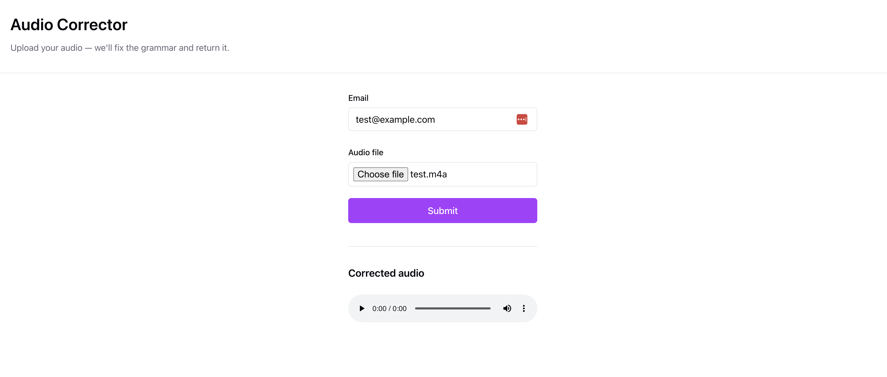

# audio-corrector

Frontend: React with Vite  
Backend: Express



## Run

```bash
# Backend (port 3001)
cd backend && npm run dev

# Frontend (port 5173)
cd frontend && npm run dev
```

## Environment

Create `backend/.env` with:

```
OPENAI_API_KEY=your-key
```
